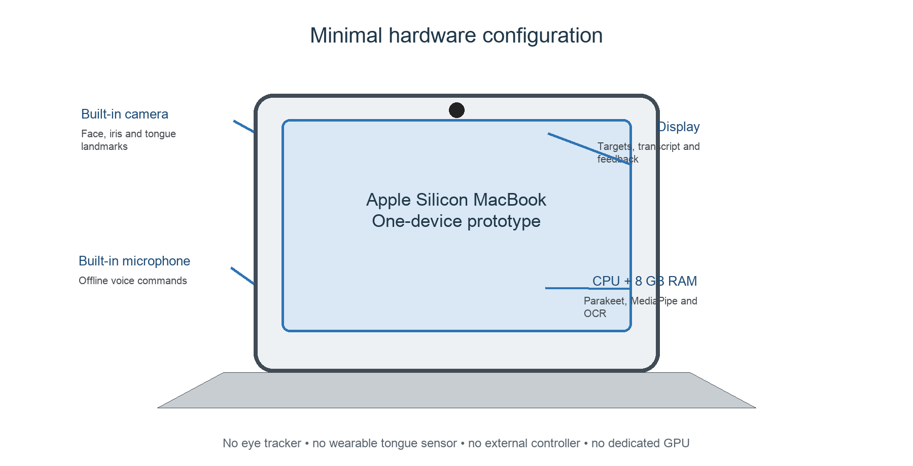

# AI-Based Multimodal Hands-Free Computer Interface

An offline-first Human–Computer Interaction (HCI) prototype for controlling
macOS without relying on a conventional mouse. It combines **voice commands**,
**head tracking**, **eye-gaze estimation**, and calibrated **tongue gestures**
for pointer movement and single-, double-, or triple-click actions.

The project uses pretrained local AI models and ordinary MacBook hardware. No
cloud API key, custom training dataset, external eye tracker, wearable sensor,
or Apple Head Pointer/Alternate Pointer Actions feature is required.

> **DA1 topic:** Voice-based control of computer actions, extended with
> camera-based assistive interaction.
>
> **Final report:** [HCI_DA1_Final_Multimodal_Hands_Free_Interface.docx](HCI_DA1_Final_Multimodal_Hands_Free_Interface.docx)

## Contents

- [System overview](#system-overview)
- [Features](#features)
- [Supported voice commands](#supported-voice-commands)
- [Hardware and software](#hardware-and-software)
- [Installation](#installation)
- [Running the application](#running-the-application)
- [Visible-screen targeting](#visible-screen-targeting)
- [Head, eye-gaze, and tongue control](#head-eye-gaze-and-tongue-control)
- [Methodology](#methodology)
- [Evaluation and testing](#evaluation-and-testing)
- [Repository structure](#repository-structure)
- [Research context](#research-context)

## System overview


The application has two independent input pipelines:

1. The **audio pipeline** captures a short utterance, transcribes it with
   MacParakeet (or Vosk fallback), parses the fixed command grammar, and either
   executes a direct action or searches for a named target.
2. The **camera pipeline** processes MediaPipe facial landmarks, estimates head
   pose or eye-gaze direction, and detects calibrated tongue
   out-and-retract gestures.

Both pipelines feed a guarded action layer. The layer checks whether control is
enabled, activates the application under the pointer when necessary, sends
native macOS or PyAutoGUI events, renders a non-activating click indicator, and
writes timestamped logs.

## Features

- Accurate offline recognition with the installed Parakeet TDT 0.6B v3 model
- Persistent model process for fast recognition after one startup warm-up
- Isolated CoreAudio capture so a native microphone failure cannot close the GUI
- Cursor movement, clicking, scrolling, browser, and tab commands
- Safe paused startup by default, with an explicit immediate-live option
- Constrained vocabulary to reduce accidental actions
- Live transcript, visual feedback, and timestamped session logs
- Dry-run mode that never controls the computer
- Guided evaluation measuring command accuracy and response time
- Semantic targeting of genuine macOS buttons, links, menu items, and controls
- Automatic exclusion of transcript text, labels, and text-entry fields
- Whole-screen local OCR fallback for browser text and desktop folder names
- Live MediaPipe head tracking through the built-in FaceTime camera
- Calibrated webcam eye-gaze estimation with smoothing and a movement dead zone
- In-app calibrated tongue sequences for single-, double-, and triple-click
- Animated numbered click ring at the exact cursor location

## Supported voice commands

| Spoken command | Action |
| --- | --- |
| `move left`, `move right`, `move up`, `move down` | Move the pointer 180 pixels |
| `click` | Left click |
| `double click` | Double click |
| `right click` | Right click |
| `scroll up`, `scroll down` | Scroll four steps |
| `open browser` | Open a blank page in the default browser |
| `new tab`, `close tab` | Use the operating system's browser shortcuts |
| `click <visible words>`, `press <visible words>` | Activate a control or click visible screen text |
| `double click <visible words>` | Double-click a control, word, or desktop folder label |
| `right click <visible words>` | Right-click a visible control or word |
| `move to <visible words>` | Move to a visible control or word without clicking |
| `pause control` | Stop executing computer actions |
| `resume control` | Enable computer actions |

## Hardware and software



### Required hardware

| Component | Purpose |
| --- | --- |
| Apple Silicon MacBook | Runs the interface and local AI inference |
| Built-in microphone | Captures spoken commands |
| Built-in FaceTime camera | Captures head, eye, and tongue gestures |
| Display | Shows target controls and visual feedback |

No EEG headset, depth camera, infrared eye tracker, glove, bend sensor, or
external controller is required.

### Required software

| Software | Role |
| --- | --- |
| macOS | Accessibility, screen capture, native event, and app activation APIs |
| Python 3.10+ | Main application and user interface |
| MacParakeet / FluidAudio | Primary offline speech-to-text engine |
| Vosk | Automatic offline speech-recognition fallback |
| MediaPipe | Face, iris, mouth, and tongue-region landmarks |
| PyAutoGUI | Pointer movement, scrolling, and keyboard shortcuts |
| PyObjC | Native macOS Accessibility and mouse-event integration |
| Tesseract OCR | Visible browser text and desktop-label recognition |
| Tkinter | Voice Cursor desktop interface |

## Installation

Python 3.10 or newer is required.

```bash
cd "/path/to/HCI-PROJECT"
python3 -m venv .venv
source .venv/bin/activate
python -m pip install --upgrade pip
python -m pip install -e .
```

The Parakeet helper is already compiled for this Apple Silicon Mac. If it ever
needs to be rebuilt after a source change, run:

```bash
cd parakeet_helper
swift build -c release
cp .build/release/voice-cursor-parakeet bin/voice-cursor-parakeet
```

On Linux, the PortAudio system package may be required. On macOS and Windows,
the `sounddevice` wheel normally includes what is needed.

### Dry run

Dry-run mode recognizes and logs speech, but it intentionally **never moves or
clicks the cursor**:

```bash
source .venv/bin/activate
voice-cursor --dry-run
```

Dry-run uses the same selected speech engine as live control. Parakeet and Vosk
both work locally without uploading microphone audio.

Use dry-run mode only to check recognition.

## Running the application

For immediate cursor movement, double-click `run_live.command` in Finder or run:

```bash
./run_live.command
```

The equivalent direct command on this Mac is:

```bash
voice-cursor --start-enabled --movement-pixels 180 --speech-engine parakeet
```

The `--start-enabled` option makes commands such as `move left` work
immediately. Without it, the app starts paused and requires `resume control` or
the **Enable** button.

The GUI includes a **Test Cursor** button. It briefly moves and restores the
pointer and reports the observed coordinates, so a permission failure is not
mistaken for a successful action.

On macOS, allow the application used to launch the project under:

1. **System Settings → Privacy & Security → Microphone**
2. **System Settings → Privacy & Security → Accessibility → Terminal**
3. **System Settings → Privacy & Security → Screen & System Audio Recording → Terminal**
4. **System Settings → Privacy & Security → Camera → Terminal**

If you launch from another terminal application, enable that application
instead. Restart Voice Cursor after changing the permission.

Move the mouse quickly to a screen corner to trigger PyAutoGUI's emergency
fail-safe. The **Pause** button and `pause control` voice command also disable
actions and stop camera pointer movement.

The default movement step is 180 pixels. Change it if desired:

```bash
voice-cursor --start-enabled --movement-pixels 300
```

## Visible-screen targeting

With live control enabled, speak an action followed by visible words. For
example:

- `click Enable`
- `click Submit`
- `double click Settings`
- `right click Downloads`
- `move to Sign In`

Voice Cursor stays visible and first checks application controls through macOS
Accessibility. If no genuine control matches, it captures the main display and
runs local Tesseract OCR to find ordinary visible words. This makes browser
text and desktop folder labels such as **Projects** available as targets.

The entire Voice Cursor window is excluded from the OCR results, while its real
registered buttons remain available. Consequently, `click Enable` activates
the actual **Enable** button without selecting “click enable” in the transcript.

The app refuses to act when nothing matches. Target matching is word-sensitive:
`project` matches only **Project**, while `projects` matches only **Projects**.
Known Finder desktop-icon labels are protected from OCR misreading, so the
**Projects** folder cannot be selected by the singular command `click project`.
Duplicate semantic controls remain ambiguous, while duplicate OCR words use the
visual selection rule below.

When the same word occurs several times, desktop-space matches are preferred;
otherwise the most visually prominent occurrence is selected. OCR can only see
what is actually visible: fully minimized windows and portions completely
covered by another window cannot be targeted until they are visible.

## Speech recognition and microphone selection

The live launcher now uses the installed MacParakeet application and its cached
Parakeet TDT 0.6B v3 Core ML model. A small local helper keeps the model loaded,
so the first startup warm-up takes approximately 20 seconds but later commands
are transcribed without reloading the model. The interface reports
**Listening with MacParakeet** when it is ready.

Microphone audio is separated into short commands using local voice-activity
detection. Stay quiet during the brief background-noise calibration, then speak
one command naturally and pause. Only finalized text is displayed.

The listener now prefers the built-in MacBook microphone and captures its audio
inside a disposable worker process. If CoreAudio or PortAudio aborts that
worker, the main Voice Cursor window and the loaded Parakeet model stay alive,
and microphone capture is restarted. To force a microphone, provide its index
or part of its name:

```bash
voice-cursor --start-enabled --speech-engine parakeet \
  --input-device "MacBook Air Microphone"
```

If the Parakeet helper cannot start, Voice Cursor reports the reason and
automatically falls back to Vosk. Vosk can also be selected explicitly:

```bash
voice-cursor --start-enabled --speech-engine vosk
```

The text after `click`, `double click`, `right click`, or `move to` can be any
accessible control name or visible OCR word. Matching is exact after
case/punctuation normalization; singular, plural, and other differently spelled
words are not treated as the same target.

## Head, eye-gaze, and tongue control

The camera controls are optional and do not replace voice control:

- **Start Head Tracking** uses MediaPipe face landmarks. Look at the screen
  centre and stay still during the brief automatic calibration, then move or
  turn your head left, right, up, or down. The pointer moves continuously like
  a joystick.
- **Start Eye Gaze** estimates iris position relative to both eyes. Look at the
  screen centre during calibration, then look in the desired direction.
- **Recalibrate Camera** resets the neutral position if the pointer drifts.
- **Stop Camera**, `pause control`, or moving the pointer to a screen corner
  stops or safely interrupts camera control.
- **Calibrate Tongue Clicks** runs entirely inside this application. First keep
  your mouth closed while phase 1 is displayed. When phase 2 appears, stick out
  your tongue and hold it steady until calibration completes.
- After calibration, stick out and fully retract your tongue once for a
  **single-click**, twice quickly for a **double-click**, or three times quickly
  for a **triple-click**. Holding the tongue out does not generate repeated
  clicks; each count requires a complete out-and-retract gesture.
- **Disable Tongue** immediately disables tongue-generated clicks while leaving
  head or gaze cursor movement active.

Tongue recognition combines the MediaPipe mouth landmarks, a normalized
mouth-region colour/geometry feature vector, and two user-specific calibration
profiles. Consecutive-frame confirmation, separate activation/retraction
thresholds, a cooldown, and one-event-per-gesture logic reduce accidental and
repeated clicks. Cursor movement freezes while a possible tongue gesture is
being confirmed so the click stays on the intended target. The app waits about
0.7 seconds after the last gesture to distinguish one gesture from two; the
third gesture executes immediately. A blue `1`, orange `2`, or purple `3`
animated ring appears around the cursor when the corresponding click executes.
The same location feedback also appears for voice and visible-target clicks;
right-click uses a red `R` ring. No Apple Head Pointer or Alternate Pointer
Actions feature is used.

Before a real click is sent, the application underneath the cursor is brought
to the foreground. The Voice Cursor window remains visible but becomes a
secondary window, so a tongue click can select another application and a
double-click can open a Finder file normally. Double- and triple-clicks use
native macOS mouse events with explicit click states `1`, `2`, and `3`, all at
the same frozen cursor coordinate. This is required because ordinary repeated
automation clicks can be interpreted by Finder as separate single clicks. The
numbered click ring is a macOS non-activating, click-through overlay: it cannot
take keyboard focus, intercept the click, or reactivate Voice Cursor.

Eye gaze from a standard RGB MacBook camera is an estimate, not a medical or
infrared eye tracker. Good front lighting, a stable seating position, and
recalibration improve it. The 3.6 MB MediaPipe face-landmark model downloads
once into `.models/`; camera frames and landmarks stay on the Mac.

### Tongue click state machine


The recognizer accepts only a complete **tongue out → tongue retracted**
transition as one gesture. A short aggregation window then maps one, two, or
three complete gestures to the corresponding click count. Hysteresis,
consecutive-frame confirmation, cooldowns, and per-user calibration prevent a
held tongue from producing repeated clicks.

## Methodology


The finalized methodology follows these stages:

1. Review research on speech HCI, assistive interfaces, gaze/head tracking,
   facial landmarks, and hands-free pointing.
2. Define a bounded command vocabulary and explicit safety rules.
3. Acquire microphone audio and webcam frames locally.
4. Run pretrained speech and landmark models without uploading user data.
5. Parse voice commands or calculate calibrated camera-control signals.
6. Resolve named on-screen targets through Accessibility first and OCR second.
7. Execute guarded cursor events and show visible click confirmation.
8. Measure recognition correctness, response time, task completion, false
   activations, and qualitative usability.
9. Refine thresholds and document limitations.

### Key safety and privacy decisions

- The application starts with an explicit enabled/paused state.
- Dry-run evaluation never performs computer actions.
- Moving the pointer to a screen corner activates PyAutoGUI's fail-safe.
- Unmatched or ambiguous targets are rejected instead of guessed.
- Transcript text and text-entry fields are excluded from target selection.
- A held tongue produces no repeated clicks.
- Audio, video, OCR, transcripts, and model inference remain local.
- Session logs contain recognized text and action outcomes, not raw audio/video.

## Evaluation and testing

### Guided evaluation

1. Launch the app in dry-run mode.
2. Click **Start Guided Evaluation**.
3. Speak the command displayed for each trial.
4. Wait for the completion dialog.

Evaluation mode never executes actions. Each trial has a twelve-second timeout.
The app exports a CSV file under `evaluation_results/` containing:

- expected command;
- recognized text and matched command;
- correct/incorrect result;
- response time;
- overall accuracy and average response time.

For a stronger report, repeat the evaluation in quiet and noisy conditions and
compare the two CSV summaries.

### Logs

Normal sessions are written to `logs/session_YYYYMMDD_HHMMSS.csv`. These files
record recognized text, matched commands, and whether an action succeeded or
was ignored.

### Automated tests

```bash
python -m unittest discover -s tests -v
```

The 65 automated tests cover command matching, safety state transitions,
dry-run behavior, target resolution, app activation, native macOS click
construction, camera calibration, tongue sequences, evaluation calculations,
timeouts, and CSV export. Microphone, webcam, and live cursor behavior also
require the manual checks described above because they depend on macOS
permissions and physical input.

### Rebuild the Word report

The submitted `.docx` and all four report diagrams are reproducible from the
checked-in scripts:

```bash
python -m pip install -r requirements-report.txt
python scripts/build_final_multimodal_report.py
```

The report generator preserves the required 30-paper literature review and DOI
links while regenerating the architecture, hardware, state-machine, and
methodology illustrations.

## Repository structure

```text
.
├── voice_cursor/          # Main Python package
│   ├── app.py             # Tkinter GUI and orchestration
│   ├── commands.py        # Fixed voice-command grammar
│   ├── actions.py         # Guarded cursor and target actions
│   ├── parakeet_speech.py # MacParakeet integration
│   ├── speech.py          # Vosk fallback
│   ├── camera_control.py  # Head, gaze, and tongue logic
│   ├── camera_worker.py   # Isolated camera processing
│   ├── screen_text.py     # Screen capture and OCR targeting
│   ├── accessibility_controls.py
│   ├── macos_clicks.py    # Native multi-click events
│   └── click_overlay_worker.py
├── parakeet_helper/       # Swift/FluidAudio speech helper
├── tests/                 # Automated unit tests
├── assets/                # Architecture and methodology diagrams
├── scripts/               # Reproducible report-generation scripts
├── run_live.command       # Double-clickable macOS launcher
├── pyproject.toml
├── requirements-report.txt
└── HCI_DA1_Final_Multimodal_Hands_Free_Interface.docx
```

## Project boundary

This prototype intentionally uses a small command grammar. It does not attempt
free-form conversation, open-ended language understanding, speaker
identification, or model training. Those additions would increase complexity
without improving the core HCI demonstration.

## Research context

- Deshmukh and Chalmeta, *User Experience and Usability of Voice User
  Interfaces: A Systematic Literature Review* (2024):
  https://doi.org/10.3390/info15090579
- Clark et al., *The State of Speech in HCI: Trends, Themes and Challenges*
  (2019): https://doi.org/10.1093/iwc/iwz016
- Ramos et al., *Low-Cost Human-Machine Interface for Computer Control with
  Facial Landmark Detection and Voice Commands* (2022):
  https://doi.org/10.3390/s22239279
