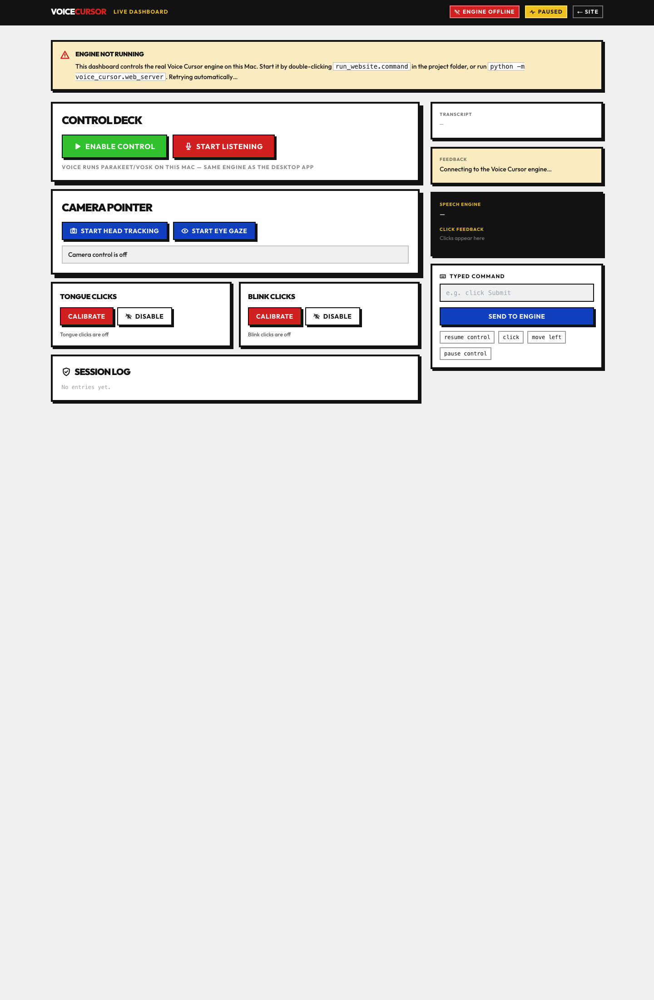
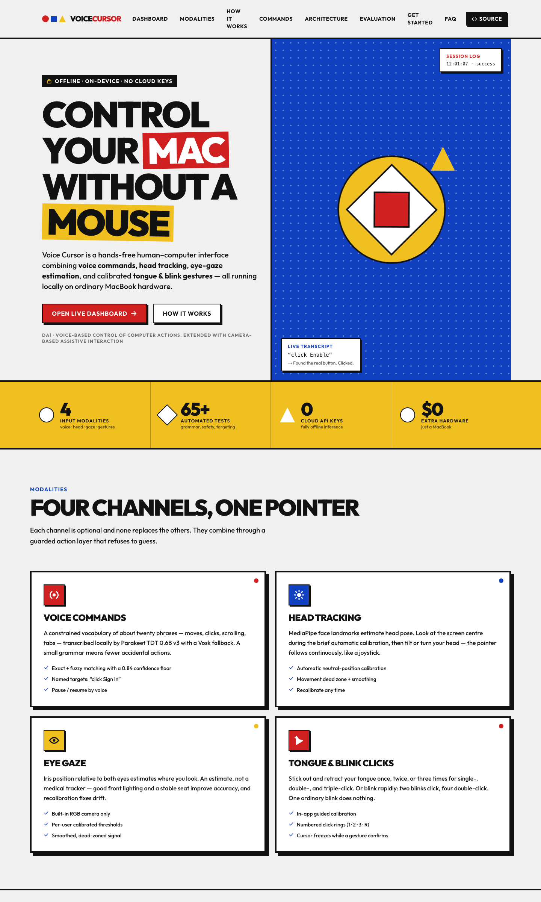
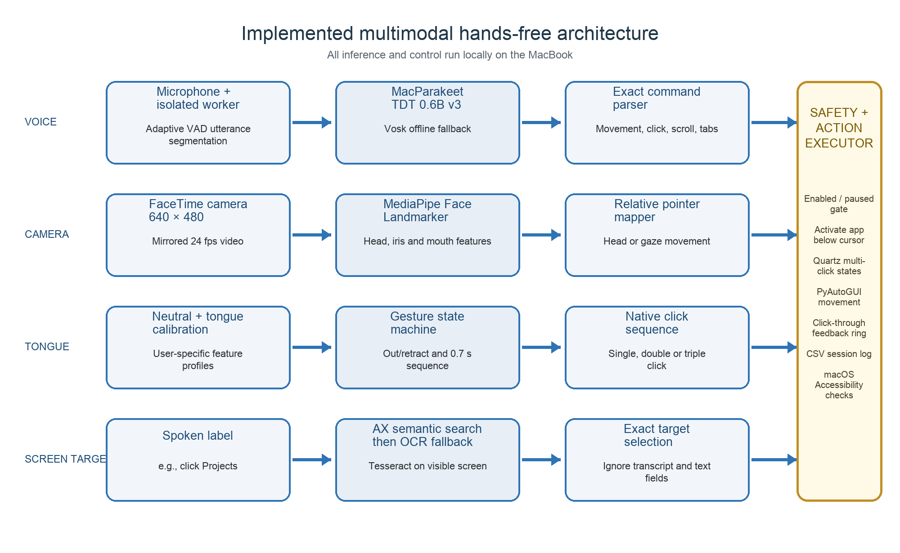
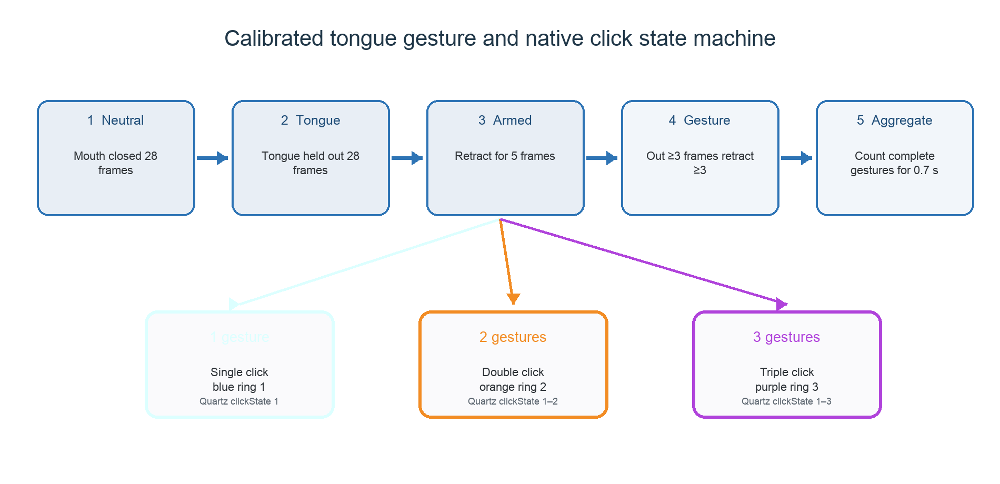
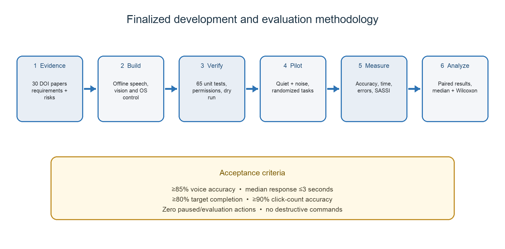

# AI-Based Multimodal Hands-Free Computer Interface

**Control macOS without a mouse.** An offline-first Human–Computer
Interaction (HCI) system that combines **voice commands**, **head tracking**,
**eye-gaze estimation**, and calibrated **tongue & blink gestures** for
pointer movement and clicks — running entirely on an ordinary MacBook with
pretrained local AI models. No cloud API key, no custom training data, no
external eye tracker, no wearable sensor.

[](assets/screenshots/dashboard.png)

> **DA1 topic:** Voice-based control of computer actions, extended with
> camera-based assistive interaction.
>
> **Final report:** [HCI_DA1_Final_Multimodal_Hands_Free_Interface.docx](HCI_DA1_Final_Multimodal_Hands_Free_Interface.docx)

---

## Contents

- [Two ways to run it](#two-ways-to-run-it)
- [Quick start](#quick-start)
- [Supported voice commands](#supported-voice-commands)
- [Website](#website)
- [System overview](#system-overview)
- [Head, eye-gaze, tongue, and blink control](#head-eye-gaze-tongue-and-blink-control)
- [Visible-screen targeting](#visible-screen-targeting)
- [Methodology](#methodology)
- [Evaluation and testing](#evaluation-and-testing)
- [Repository structure](#repository-structure)
- [Research context](#research-context)

---

## Two ways to run it

Both interfaces drive the **same engine** — identical grammar, identical
safety rules, identical guarded actions.

| | Desktop app | Web dashboard |
| --- | --- | --- |
| **Start it** | `./run_live.command` | `./run_website.command` |
| **Interface** | Tk window | Browser at `localhost:8757/dashboard` |
| **Voice** | Parakeet / Vosk, continuous | Same — streamed to the page live |
| **Camera** | Head / gaze / tongue / blink | Same — calibrated from the page |
| **Extras** | Guided evaluation mode | Live telemetry, session log, click rings |

The dashboard is the easier demo surface: the browser page connects over
WebSocket to the engine running on your Mac and becomes a full remote
control. (Browsers cannot move a real pointer by themselves — the page
pilots the Python engine that can, the same pattern as Jupyter or Ollama
web UIs.)

[](assets/screenshots/landing-hero.png)

## Quick start

**Requirements:** Apple Silicon MacBook, Python 3.10+, macOS permissions
(Microphone, Camera, Accessibility, Screen Recording — granted to Terminal).

```bash
# 1 — get the repository
mkdir ~/projects && cd ~/projects
git clone https://github.com/UtkarsHMer05/AI-Multimodal-Hands-Free-Computer-Interface.git
cd AI-Multimodal-Hands-Free-Computer-Interface

# 2 — install the dependencies
python3 -m venv .venv
source .venv/bin/activate
python -m pip install -e .

# 3 — grant macOS permissions (one-time, System Settings → Privacy & Security)
#    Microphone · Camera · Accessibility · Screen & System Audio Recording → Terminal

# 4 — start the website (engine + dashboard)
./run_website.command        # → opens http://localhost:8757/dashboard

# …or the desktop app
./run_live.command           # → Tk window, live control immediately

# …or the safest first look (recognizes speech, never acts)
python -m voice_cursor --dry-run
```

On the dashboard press **Enable control** → **Start listening**, then just
speak: *"move left"*, *"click"*, *"click Submit"*, *"pause control"*.
Everything the engine hears and does streams back to the page — transcript,
feedback, session log, and numbered click rings.

## Supported voice commands

| Spoken command | Action |
| --- | --- |
| `move left`, `move right`, `move up`, `move down` | Move the pointer 180 pixels |
| `click` | Left click |
| `double click` | Double click |
| `right click` | Right click |
| `scroll up`, `scroll down` | Scroll four steps |
| `open browser` | Open a blank page in the default browser |
| `new tab`, `close tab` | Use the operating system's browser shortcuts |
| `click <visible words>`, `press <visible words>` | Activate a control or click visible screen text |
| `double click <visible words>` | Double-click a control, word, or desktop folder label |
| `right click <visible words>` | Right-click a visible control or word |
| `move to <visible words>` | Move to a visible control or word without clicking |
| `pause control` | Stop executing computer actions |
| `resume control` | Enable computer actions |

Matching ignores capitalization, spaces, and separators — `backend`, `back
end`, and `BACK-END` are the same target — but stays spelling-sensitive:
`project` never matches **Projects**. Unmatched or ambiguous targets are
**refused, never guessed**.

## Website

The [`website/`](website) folder holds a Next.js + TypeScript + Tailwind app
with two surfaces:

- **`/` — landing page** (static, deployable to Vercel / Netlify / GitHub
  Pages): the project showcase — modalities, full grammar table, the real
  architecture diagrams, safety rules, evaluation method, FAQ, and a
  step-by-step Get Started guide.
- **`/dashboard` — live control surface**: connects over WebSocket to the
  engine ([`voice_cursor/web_server.py`](voice_cursor/web_server.py)) and
  mirrors every Tk control — enable/pause, listening, head tracking, eye
  gaze, tongue & blink calibration, typed commands, transcript, feedback,
  logs, and click-ring notifications.

The command engine itself is also ported to TypeScript
([`website/src/lib/commands.ts`](website/src/lib/commands.ts)) with
byte-for-byte parity — asserted by
[`scripts/verify_port_parity.py`](scripts/verify_port_parity.py) over a
shared battery of utterances (161/161 cases match, including the difflib
similarity threshold, ambiguous-target refusal, and the
spelling-sensitive matching key).

```bash
cd website
npm install
npm run dev          # landing-page development
npm run build        # static export used by the engine server
```

The engine server serves the built site and the WebSocket bridge on one
port (default 8757) — `run_website.command` does all of it in one
double-click.

## System overview



Two independent input pipelines feed a guarded action layer:

1. The **audio pipeline** captures a short utterance, transcribes it with
   MacParakeet (or Vosk fallback), parses the fixed command grammar, and
   either executes a direct action or searches for a named target.
2. The **camera pipeline** processes MediaPipe facial landmarks, estimates
   head pose or eye-gaze direction, and detects calibrated tongue and
   rapid-blink gesture sequences.

The guarded layer checks whether control is enabled, activates the
application under the pointer when necessary, sends native macOS or
PyAutoGUI events, renders a non-activating numbered click ring, and writes
timestamped logs.

### Key safety and privacy decisions

- The application starts paused, with an explicit enabled state.
- Dry-run evaluation never performs computer actions.
- Moving the pointer to a screen corner activates the emergency failsafe.
- Unmatched or ambiguous targets are rejected instead of guessed.
- Transcript text and text-entry fields are excluded from target selection.
- A held tongue produces no repeated clicks.
- Audio, video, OCR, transcripts, and model inference remain local.
- Session logs contain recognized text and action outcomes, not raw media.

## Head, eye-gaze, tongue, and blink control

The camera controls are optional and do not replace voice control:

- **Head tracking** uses MediaPipe face landmarks. Look at the screen
  centre during the brief automatic calibration, then move or turn your
  head — the pointer moves continuously like a joystick.
- **Eye gaze** estimates iris position relative to both eyes. Look at the
  screen centre during calibration, then look in the desired direction.
- **Recalibrate** resets the neutral position if the pointer drifts.
- **Tongue clicks**: stick out and fully retract your tongue once for a
  **single-click**, twice quickly for a **double-click**, three times for a
  **triple-click**. Holding the tongue out never repeats clicks.
- **Blink clicks**: blink rapidly twice for a **single-click** or four
  times for a **double-click**. One ordinary blink does nothing, three are
  ignored, and holding the eyes closed never clicks.
- Both gesture channels can run at the same time; a short arbitration
  cooldown prevents duplicate detections.

Tongue recognition combines MediaPipe mouth landmarks, a normalized
mouth-region colour/geometry feature vector, and two user-specific
calibration profiles. Consecutive-frame confirmation, separate
activation/retraction thresholds, a cooldown, and one-event-per-gesture
logic reduce accidental and repeated clicks. Cursor movement freezes while a
possible gesture is confirmed so the click lands on the intended target. A
blue `1`, orange `2`, or purple `3` animated ring appears at the cursor
when the click executes; right-click uses a red `R` ring.



Before a real click is sent, the application underneath the cursor is
brought to the foreground, so a tongue click can select another app and a
double-click can open a Finder file normally. Double- and triple-clicks
use native macOS mouse events with explicit click states `1`, `2`, and `3`
at the same frozen coordinate — Finder interprets ordinary repeated
automation clicks as separate singles otherwise. The numbered click ring is
a non-activating, click-through overlay: it cannot take keyboard focus,
intercept the click, or reactivate the control window.

Eye gaze from a standard RGB camera is an estimate, not a medical or
infrared eye tracker. Good front lighting, a stable seating position, and
recalibration improve it. The 3.6 MB MediaPipe model downloads once into
`.models/`; camera frames and landmarks never leave the Mac.

## Visible-screen targeting

With live control enabled, speak an action followed by visible words:

- `click Enable` · `click Submit` · `double click Settings`
- `right click Downloads` · `move to Sign In`

The engine first checks application controls through macOS Accessibility.
If no genuine control matches, it captures the display and runs local
Tesseract OCR to find ordinary visible words — browser text and desktop
folder labels such as **Projects** become available as targets. Only
genuinely visible portions are searched: covered or minimized windows
cannot be targeted. Known Finder desktop-icon labels are protected from
OCR misreading, so the **Projects** folder cannot be selected by the
singular command `click project`.

## Methodology



1. Review research on speech HCI, assistive interfaces, gaze/head tracking,
   facial landmarks, and hands-free pointing.
2. Define a bounded command vocabulary and explicit safety rules.
3. Acquire microphone audio and webcam frames locally.
4. Run pretrained speech and landmark models without uploading user data.
5. Parse voice commands or calculate calibrated camera-control signals.
6. Resolve named on-screen targets through Accessibility first and OCR
   second.
7. Execute guarded cursor events and show visible click confirmation.
8. Measure recognition correctness, response time, task completion, false
   activations, and qualitative usability.
9. Refine thresholds and document limitations.

## Evaluation and testing

### Guided evaluation

Launch the desktop app, click **Start Guided Evaluation**, and speak the
command displayed for each trial. Evaluation mode never executes actions;
each trial has a twelve-second timeout. The app exports a CSV under
`evaluation_results/` with the expected command, recognized text, matched
command, correctness, response time, and summary accuracy and average
response seconds. Repeating the evaluation under quiet and noisy
conditions and comparing the two CSVs gives a stronger report.

### Logs

Normal sessions are written to `logs/session_YYYYMMDD_HHMMSS.csv`,
recording recognized text, matched commands, and whether each action
succeeded or was ignored.

### Automated tests

```bash
python -m unittest discover -s tests -v
```

The suite covers command matching, safety state transitions, dry-run
behavior, target resolution, app activation, native macOS click
construction, camera calibration, tongue sequences, evaluation
calculations, timeouts, and CSV export. Microphone, webcam, and live cursor
behavior additionally require the manual checks described above, because
they depend on macOS permissions and physical input.

### Command-engine parity (website ↔ app)

```bash
python scripts/verify_port_parity.py
```

Runs both the Python engine and the TypeScript port over a shared battery
of utterances, similarity pairs, and target matches — fails on any
divergence. Current status: **161/161 cases match**.

### Rebuild the Word report

```bash
python -m pip install -r requirements-report.txt
python scripts/build_final_multimodal_report.py
```

The submitted `.docx` and all four report diagrams are reproducible from
the checked-in scripts, preserving the 30-paper literature review and DOI
links.

## Repository structure

```text
.
├── voice_cursor/            # Main Python package
│   ├── app.py               # Tkinter GUI and orchestration
│   ├── web_server.py        # Engine + website + WebSocket dashboard server
│   ├── commands.py          # Fixed voice-command grammar
│   ├── actions.py           # Guarded cursor and target actions
│   ├── parakeet_speech.py   # MacParakeet integration
│   ├── speech.py            # Vosk fallback
│   ├── camera_control.py    # Head, gaze, tongue, blink logic
│   ├── camera_worker.py     # Isolated MediaPipe processing
│   ├── screen_text.py       # Screen capture and OCR targeting
│   ├── accessibility_controls.py
│   ├── macos_clicks.py      # Native multi-click events
│   └── click_overlay_worker.py
├── website/                 # Next.js + TypeScript site (landing + dashboard)
├── parakeet_helper/         # Swift/FluidAudio speech helper
├── tests/                   # Automated unit tests
├── assets/                  # Diagrams and screenshots
├── scripts/                 # Report generation + parity verification
├── run_live.command         # Desktop app launcher
├── run_website.command      # Engine + dashboard launcher
├── pyproject.toml
└── HCI_DA1_Final_Multimodal_Hands_Free_Interface.docx
```

## Project boundary

This prototype intentionally uses a small command grammar. It does not
attempt free-form conversation, open-ended language understanding, speaker
identification, or model training. Those additions would increase
complexity without improving the core HCI demonstration.

## Research context

- Deshmukh and Chalmeta, *User Experience and Usability of Voice User
  Interfaces: A Systematic Literature Review* (2024):
  https://doi.org/10.3390/info15090579
- Clark et al., *The State of Speech in HCI: Trends, Themes and Challenges*
  (2019): https://doi.org/10.1093/iwc/iwz016
- Ramos et al., *Low-Cost Human-Machine Interface for Computer Control with
  Facial Landmark Detection and Voice Commands* (2022):
  https://doi.org/10.3390/s22239279
